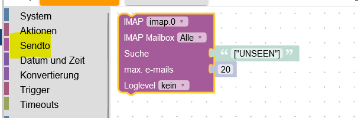
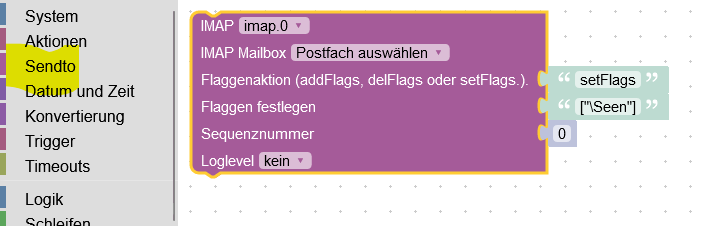
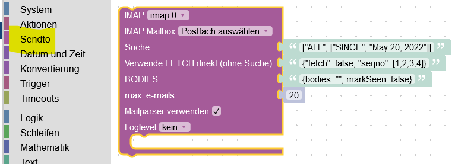
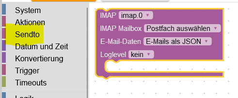

# ioBroker.imap

**Tests:** 

## imap adapter for ioBroker

Monitor your email accounts via IMAP (Internet Message Access Protocol)

## Tested with

-   1und1
-   gmail <https://support.google.com/mail/answer/185833?hl=de>
-   vodafone
-   strato

## Description and Questions

**Instance configuration**

-   Active: Enable IMAP connection
-   Host: e.g. imap.gmail.com
-   Hostname: use default INBOX
-   Port: use default 993
-   Username: username
-   Password: password
-   max.: Maximum number of data points (1-99)
-   max. HTML: Maximum number of mails that are output as HTML (1-99)
-   TLS: Transport Layer Security - use default true
-   Flag: use All
-   ICON: device folder icon (upload under TAB 'Create icons')
-   Token: token for xoauth2 connection (not tested)
-   tls-Option: use default {"rejectUnauthorized": false}
-   Auto-TLS: possible selection always, required and never. Default never
    **For more information please read [here](https://www.npmjs.com/package/node-imap)**

-   imap.0.xx.email: The mails are created here as set in the instance.
-   imap.0.xx.remote.html: Here you can customize your CSS style
-   imap.0.xx.remote.criteria: New search (also possible as Blockly)
-   imap.0.xx.remote.show_mails: Maximum output (also possible as Blockly)
-   imap.0.xx.remote.search_start: Apply show_mails and criteria values (also possible as Blockly)
-   imap.0.xx.remote.reload_emails: Apply CSS changes
-   imap.0.xx.html: HTML Code for VIS
-   imap.0.xx.last_activity: last activity (Update/New mail)
-   imap.0.xx.last_activity_json: last activity as JSON e.g. {"flags": ["\Seen"]} email is read
-   imap.0.xx.last_activity_timestamp: timestamp last activity
-   imap.0.xx.online: is connected
-   imap.0.xx.quality: Quality of the data points (automatic check every 24 hours)
-   imap.0.xx.total: Counts your emails
-   imap.0.xx.total_unread: Counts unread emails
-   imap.0.xx.remote.change_folder : Change folder
-   imap.0.xx.active_inbox: Selected folder
-   imap.0.xx.json: VIS json_table

**<https://forum.iobroker.net/topic/63400/test-adapter-iobroker-imap-v0-0-1-github>**

## Changelog

<!--
    Placeholder for the next version (at the beginning of the line):
    ### **WORK IN PROGRESS**
-->

### **WORK IN PROGRESS**

-   (Lucky-ESA) Added: Limited reconnected (5 max)
-   (Lucky-ESA) Added: into datapoints
-   (Lucky-ESA) Added: Password entry not possible without an active instance
-   (Lucky-ESA) Added: Added description to reradme
-   (Lucky-ESA) Fix: debug output without attachments
-   (Lucky-ESA) Fix: wrong json_table
-   (Lucky-ESA) Fix: value null
-   (Lucky-ESA) Change: Reconnected change info level to debug level

### 0.0.4 (2023-03-03)

-   (Lucky-ESA) Fix json_table

### 0.0.3 (2023-03-03)

-   (Lucky-ESA) Beta release

### 0.0.2 (2023-03-03)

-   (Lucky-ESA) initial release

## License

MIT License

Copyright (c) 2023 Lucky-ESA <github@luckyskills.de>

Permission is hereby granted, free of charge, to any person obtaining a copy
of this software and associated documentation files (the "Software"), to deal
in the Software without restriction, including without limitation the rights
to use, copy, modify, merge, publish, distribute, sublicense, and/or sell
copies of the Software, and to permit persons to whom the Software is
furnished to do so, subject to the following conditions:

The above copyright notice and this permission notice shall be included in all
copies or substantial portions of the Software.

THE SOFTWARE IS PROVIDED "AS IS", WITHOUT WARRANTY OF ANY KIND, EXPRESS OR
IMPLIED, INCLUDING BUT NOT LIMITED TO THE WARRANTIES OF MERCHANTABILITY,
FITNESS FOR A PARTICULAR PURPOSE AND NONINFRINGEMENT. IN NO EVENT SHALL THE
AUTHORS OR COPYRIGHT HOLDERS BE LIABLE FOR ANY CLAIM, DAMAGES OR OTHER
LIABILITY, WHETHER IN AN ACTION OF CONTRACT, TORT OR OTHERWISE, ARISING FROM,
OUT OF OR IN CONNECTION WITH THE SOFTWARE OR THE USE OR OTHER DEALINGS IN THE
SOFTWARE.
