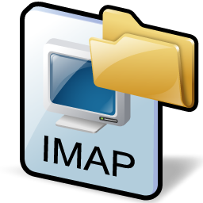

# ioBroker.imap

**Infos:**  

 

 
**Version:**  

**Tests:**  

## imap adapter for ioBroker

- Monitor your email accounts via IMAP (Internet Message Access Protocol)
- Receive notification of new emails or updates (e. g. marked unseen)
- Simple login with password and username (without xoauth2 or xoauth).

## Requirements

- Node 22 or 24
- JS-Controller >= 7.0.7
- Admin >= 7.8.23
- ~150 MB free ram

## Tested with

- 1und1
- gmail [app-password](https://support.google.com/mail/answer/185833?hl=de)
- vodafone
- strato
- outlook (e. g. [OAuth 2.0 authorization](https://learn.microsoft.com/en-us/entra/identity-platform/quickstart-register-app?tabs=certificate))

## Description

🇬🇧 [Description](/docs/en/README.md) 
🇩🇪 [Beschreibung](/docs/de/README.md)

## Questions

🇩🇪 [Fragen](https://forum.iobroker.net/topic/63400/test-adapter-iobroker-imap-latest-stable)

<!--
    Placeholder for the next version (at the beginning of the line):
    ### **WORK IN PROGRESS**
-->

## Changelog

### 0.4.0 (2026-05-30)

- (copilot) Adapter requires node.js >= 22 now
- (Lucky-ESA) Description revised
- (Lucky-ESA) Admin 7.8.23 required
- (Lucky-ESA) JS-Controller 7.0.7 required
- (Lucky-ESA) Added meta object for attachments

### 0.3.0 (2024-12-07)

- (Lucky-ESA) Mailbox folder delete added
- (Lucky-ESA) Mailbox folder create added
- (Lucky-ESA) Change Mailbox Folder name added
- (Lucky-ESA) IMAP package changed
- (Lucky-ESA) Migration to ESLint9

### 0.2.2 (2024-11-07)

- (Lucky-ESA) New design for settings page added
- (Lucky-ESA) Crash if uid is empty for new emails

### 0.2.1 (2024-09-16)

- (Lucky-ESA) Update dependencies
- (Lucky-ESA) Changed Log info to debug
- (Lucky-ESA) Fixed blockly setFlag crash

### 0.2.0 (2024-06-15)

- (Lucky-ESA) Updated Blockly definitions
- (Lucky-ESA) JS-Controller >= 5.0.19 required
- (Lucky-ESA) Admin >=6.13.16 required

[Older changelogs can be found there](CHANGELOG_OLD.md)

## License

MIT License

Copyright (c) 2023-2026 Lucky-ESA <github@luckyskills.de>

Permission is hereby granted, free of charge, to any person obtaining a copy
of this software and associated documentation files (the "Software"), to deal
in the Software without restriction, including without limitation the rights
to use, copy, modify, merge, publish, distribute, sublicense, and/or sell
copies of the Software, and to permit persons to whom the Software is
furnished to do so, subject to the following conditions:

The above copyright notice and this permission notice shall be included in all
copies or substantial portions of the Software.

THE SOFTWARE IS PROVIDED "AS IS", WITHOUT WARRANTY OF ANY KIND, EXPRESS OR
IMPLIED, INCLUDING BUT NOT LIMITED TO THE WARRANTIES OF MERCHANTABILITY,
FITNESS FOR A PARTICULAR PURPOSE AND NONINFRINGEMENT. IN NO EVENT SHALL THE
AUTHORS OR COPYRIGHT HOLDERS BE LIABLE FOR ANY CLAIM, DAMAGES OR OTHER
LIABILITY, WHETHER IN AN ACTION OF CONTRACT, TORT OR OTHERWISE, ARISING FROM,
OUT OF OR IN CONNECTION WITH THE SOFTWARE OR THE USE OR OTHER DEALINGS IN THE
SOFTWARE.
