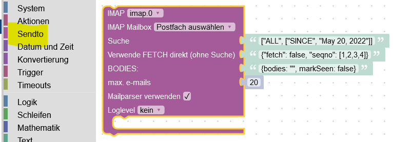

# ioBroker.imap

**Instance configuration**

-   Active: Enable IMAP connection
-   Host: e.g. imap.gmail.com
-   Hostname: use default INBOX
-   Port: use default 993
-   Username: username
-   Password: password
-   max.: Maximum number of data points (1-99)
-   max. HTML: Maximum number of mails that are output as HTML (1-99)
-   TLS: Transport Layer Security - use default true
-   Flag: use All
-   ICON: device folder icon (upload under TAB 'Create icons')
-   Token: token for xoauth2 connection (not tested)
-   tls-Option: use default {"rejectUnauthorized": false}
-   Auto-TLS: possible selection always, required and never. Default never
    **For more information please read [here](https://www.npmjs.com/package/node-imap)**

-   imap.0.xx.email: The mails are created here as set in the instance.
-   imap.0.xx.remote.html: Here you can customize your CSS style
-   imap.0.xx.remote.criteria: New search (also possible as Blockly)
-   imap.0.xx.remote.show_mails: Maximum output (also possible as Blockly)
-   imap.0.xx.remote.search_start: Apply show_mails and criteria values (also possible as Blockly)
-   imap.0.xx.remote.reload_emails: Apply CSS changes
-   imap.0.xx.html: HTML Code for VIS
-   imap.0.xx.last_activity: last activity (Update/New mail)
-   imap.0.xx.last_activity_json: last activity as JSON e.g. {"flags": ["\Seen"]} email is read
-   imap.0.xx.last_activity_timestamp: timestamp last activity
-   imap.0.xx.online: is connected
-   imap.0.xx.quality: Quality of the data points (automatic check every 24 hours)
-   imap.0.xx.total: Counts your emails
-   imap.0.xx.total_unread: Counts unread emails
-   imap.0.xx.remote.change_folder : Change folder
-   imap.0.xx.active_inbox: Selected folder
-   imap.0.xx.json: VIS json_table

-   text
    

-   text
    

-   text
    

-   text
    
