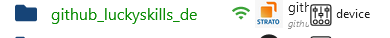
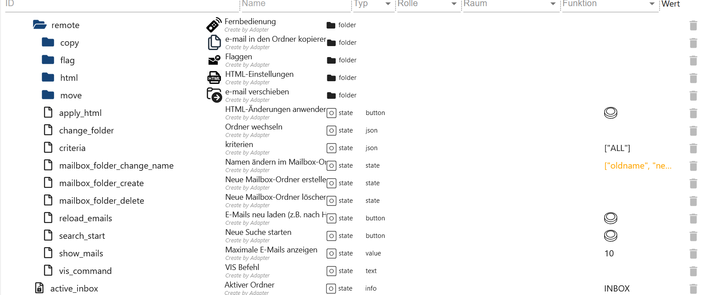

# ioBroker.imap

```:warning: ⚠
Dieser Adapter kann das System sehr schnell zum Absturz bringen.
Daher bitte diese Beschreibung aufmerksam durchlesen.
```

# Zusammenfassung

-   Instanz Einstellungen
    -   [Einstellungen TAB IMAP](#instanz-konfiguration-tab-imap-erstellen)
    -   [Einstellungen TAB Symbole](#instanz-konfiguration-tab-symbole-erstellen)
    -   [Einstellungen TAB Mailparser](#instanz-konfiguration-tab-mailparser-optionen-erstellen)
-   Datenpunkte
    -   [Datenpunkte imap.0](#datenpunkte-imap0)
    -   [Datenpunkte imap.0.benutzername](#datenpunkte-imap0benutzername)
    -   [Datenpunkte imap.0.benutzername.email.emails_xx](#datenpunkte-imap0benutzernameemailemail_xx)
    -   [Datenpunkte imap.0.benutzername.infos](#datenpunkte-imap0benutzernameinfos)
    -   [Datenpunkte imap.0.benutzername.remote](#datenpunkte-imap0benutzernameremote)
    -   [Datenpunkte imap.0.benutzername.remote.copy](#datenpunkte-imap0benutzernameremotecopy)
    -   [Datenpunkte imap.0.benutzername.remote.flag](#datenpunkte-imap0benutzernameremoteflag)
    -   [Datenpunkte imap.0.benutzername.remote.html](#datenpunkte-imap0benutzernameremotehtml)
    -   [Datenpunkte imap.0.benutzername.remote.move](#datenpunkte-imap0benutzernameremotemove)

# Beschreibungen

### Instanz Konfiguration TAB IMAP erstellen

[Zusammenfassung](#zusammenfassung)

-   `Aktiv`: IMAP Verbindung aktivieren
-   `Host`: z. Bsp. imap.gmail.com
-   `Posteingang`: Standard INBOX - Box die Überwacht werden soll - Mögliche Auswahl siehe imap.0.xxx.remote.change_folder
-   `Port`: Standard 993
-   `Nutzername`: Benutzername - Instanz muss aktiviert sein!!!
-   `Passwort`: Passwort - Instanz muss aktiviert sein!!!


-   `max.`: Maximale Anlage als Datenpunkte email_01...email_02... (1-99)
-   `max. HTML`: Maximale Anzahl von eMails als HTML. Spööte größer sein als max. Datenpunkte (1-99)
-   `TLS`: TLS-Verbindung verwenden - Standard ist true
-   `Flaggen`: Mögliche Flags im Code

```
ALL - alle – Alle Nachrichten.
ANSWERED - geantwortet – Nachrichten mit gesetzter Beantwortet-Flagge.
DELETED - gelöscht – Nachrichten mit gesetzter Gelöscht-Flagge.
DRAFT - Entwurf – Nachrichten mit gesetzter Entwurfsflagge.
FLAGGED - gekennzeichnet – Nachrichten mit gesetzter Flagge.
NEW - neu – Nachrichten, bei denen das Flag „Zuletzt verwendet“ gesetzt ist, aber nicht das Flag „Gesehen“.
SEEN - gesehen – Nachrichten, bei denen das Flag „Gesehen“ gesetzt ist.
RECENT - jüngste – Nachrichten, bei denen das Flag „Zuletzt verwendet“ gesetzt ist.
OLD - alt – Nachrichten, für die das Flag „Zuletzt verwendet“ nicht gesetzt ist. Dies entspricht funktional !RECENT (im Gegensatz zu „!NEW“).
UNANSWERED - unbeantwortet – Nachrichten, bei denen das Flag „Beantwortet“ nicht gesetzt ist.
UNDELETED - ungelöscht – Nachrichten, für die das Flag „Gelöscht“ nicht gesetzt ist.
UNDRAFT - kein Entwurf – Nachrichten, bei denen das Draft-Flag nicht gesetzt ist.
UNFLAGGED - ungekennzeichnet – Nachrichten, für die das Flag „Markiert“ nicht gesetzt ist.
UNSEEN - ungesehen – Nachrichten, bei denen das Flag „Gesehen“ nicht gesetzt ist.
```

-   `Symbol auswählen`: Symbol für den Ordner (unter TAB `Symbole erstellen` hochladen)



-   `tls-Option`: Standard ist {"rejectUnauthorized": false}
-   `Auto-TLS`: Mögliche Auswahl ist `always`, `required` and `never`. Standard ist never
    **Für mehr Informationen bitte [hier](https://www.npmjs.com/package/node-imap) lesen.**


-   `Att.`: Um das Feld HTML zu füllen müssen Anhänge mit geladen werden. Das verbraucht sehr viel RAM!!! Daher Standard `false`
-   `Mailparser-Option`: Mailparser-Option (erst unter TAB `MAILPARSER-OPTIONEN` erstellen)


-   `max. MEMRSS-Limit:` Ab wann die u. a. Aktion ausgelöst wird.
-   `Neu starten:` Ist das MEMRSS Limit erreicht wird der Adapter neu gestartet. Es wird allerdings nur alle 24h geprüft.


-   `Datenpunkt:` Ist das MEMRSS Limit erreicht wird der ausgewählt Datenpunkt auf `true` gesetzt. Dieser muss manuell zurückhesetzt werden. Es wird allerdings nur alle 24h geprüft.


-   `Senden:` Ist das MEMRSS Limit erreicht wird eine Nachricht versendet. Es wird dann bei jeder Aktualisierung von `MEMRSS` eine Nachricht versendet.
    -   `Instanzen:` Beispiel: telegram.0,telegram.1,pushover.0
    -   `Instanzen Benutzer:` Beispiel: Peter,Olaf,Thomas


### Instanz Konfiguration TAB Symbole erstellen

[Zusammenfassung](#zusammenfassung)

-   `Symbolname:` Name für das Symbol. Bitte keine doppelten Namen verwenden. Es wird dann bei Adapterstart ein Error im Logeintrag generiert.
-   `Upload:` Das Icon hochladen.


### Instanz Konfiguration TAB Mailparser Optionen erstellen

[Zusammenfassung](#zusammenfassung)

-   `Name:` Name vom Mailparser. Bitte keine doppelten Namen verwenden. Es wird dann bei Adapterstart ein Error im Logeintrag generiert. Genaue Beschreibung kann [hier](https://nodemailer.com/extras/mailparser/) gelesen werden.
-   `HTML in Text überspringen:` Generiert keinen Klartext aus HTML
-   `Maximale HTML-Länge zum Parsen:` Die maximale Menge an zu analysierendem HTML in Bytes. Wird diese überschritten werden nur Header Daten generiert.
-   `Bildlinks überspringen:` Überspringt die Konvertierung von CID-Anhängen in Daten-URL-Bilder. Bilder werden nicht als base64 konvertiert was `enormen RAM Verbrauch` einspart.
-   `Text in HTML überspringen:` Generiert kein HTML aus Klartextnachrichten
-   `Textlinks überspringen:` Verlink keine Links in Klartextinhalten


### Datenpunkte `imap.0`

[Zusammenfassung](#zusammenfassung)

| Objekt                | Beschreibung                                                       |
| --------------------- | ------------------------------------------------------------------ |
| imap.0.json_imap      | Name der IMAP Verbindung mit der letzten Aktivität                 |
| imap.0.json_table     | Letzte Aktualisierung einer IMAP Verbindung als JSON Table für VIS |
| imap.0.online_counter | Anzahl der aktiven IMAP Verbindungen                               |
| imap.0.online_history | History der Verbindungsaktivitäten als JSON                        |


### Datenpunkte `imap.0.benutzername`

[Zusammenfassung](#zusammenfassung)

| Objekt                             | Beschreibung                                                     |
| ---------------------------------- | ---------------------------------------------------------------- |
| imap.0.xxx.active_inbox            | Aktive Inbox                                                     |
| imap.0.xxx.host                    | Hostname                                                         |
| imap.0.xxx.html                    | HTML Code für VIS                                                |
| imap.0.xxx.json                    | JSON Table für VIS                                               |
| imap.0.xxx.last_activity           | Letzte Aktivität                                                 |
| imap.0.xxx.last_activity_json      | Welche Aktivität als JSON                                        |
| imap.0.xxx.last_activity_timestamp | Zeitstempel der letzten Aktivität                                |
| imap.0.xxx.online                  | Status der IMAP Verbindung                                       |
| imap.0.xxx.quality                 | Qualität aller Datenpunkte als JSON. Wird alle 24h aktualisiert. |
| imap.0.xxx.status                  | Infos zur IMAP Verbindung als JSON                               |
| imap.0.xxx.total                   | Anzahl der Mails der aktiven Inbox                               |
| imap.0.xxx.total_unread            | Anzahl der ungelesenen Mails der aktiven Inbox                   |


### Datenpunkte `imap.0.benutzername.email.email_xx`

[Zusammenfassung](#zusammenfassung)

| Objekt                                | Beschreibung                          |
| ------------------------------------- | ------------------------------------- |
| imap.0.xxx.email.email_01.attach      | Anzahl der Anhänge und Bilder im Body |
| imap.0.xxx.email.email_01.attach_json | Infos der Anhänge als JSON            |
| imap.0.xxx.email_01.content           | Inhalt der eMail                      |
| imap.0.xxx.email.email_01.flag        | Flags der eMail                       |
| imap.0.xxx.email.email_01.from        | Versender als Array                   |
| imap.0.xxx.email.email_01.receive     | Datum wann erhalten                   |
| imap.0.xxx.email.email_01.seq         | Sequenznummer                         |
| imap.0.xxx.email.email_01.size        | Größe der eMail in Byte               |
| imap.0.xxx.email.email_01.subject     | Betreff der eMail                     |
| imap.0.xxx.email.email_01.texthtml    | Inhalt als HTML                       |
| imap.0.xxx.email.email_01.to          | Empfänger als Array                   |
| imap.0.xxx.email.email_01.uid         | Eindeutige UID                        |


### Datenpunkte `imap.0.benutzername.infos`

[Zusammenfassung](#zusammenfassung)

| Objekt                                      | Beschreibung                      |
| ------------------------------------------- | --------------------------------- |
| imap.0.xxx.infos.all_capability             | Alle Features der IMAP Verbindung |
| imap.0.xxx.infos.auth_cram-md5              |                                   |
| imap.0.xxx.infos.auth_xoauth                |                                   |
| imap.0.xxx.infos.auth_xoauth2               |                                   |
| imap.0.xxx.infos.condstore                  |                                   |
| imap.0.xxx.infos.esearch                    |                                   |
| imap.0.xxx.infos.id                         |                                   |
| imap.0.xxx.infos.idle                       |                                   |
| imap.0.github*luckyskills_de.infos.literal* |                                   |
| imap.0.xxx.infos.logindisabled              |                                   |
| imap.0.xxx.infos.logindisabled              |                                   |
| imap.0.xxx.infos.namespace                  |                                   |
| imap.0.xxx.infos.quota                      |                                   |
| imap.0.xxx.infos.sasl-ir                    |                                   |
| imap.0.xxx.infos.sort                       |                                   |
| imap.0.xxx.infos.sort_display               |                                   |
| imap.0.xxx.infos.starttls                   |                                   |
| imap.0.xxx.infos.thread_orderedsubject      |                                   |
| imap.0.xxx.infos.thread_references          |                                   |
| imap.0.xxx.infos.unselect                   |                                   |
| imap.0.xxx.infos.x-gm-ext-1                 |                                   |


### Datenpunkte `imap.0.benutzername.remote`

[Zusammenfassung](#zusammenfassung)

| Objekt                          | Beschreibung |
| ------------------------------- | ------------ |
| imap.0.xxx.remote.apply_html    |              |
| imap.0.xxx.remote.change_folder |              |
| imap.0.xxx.remote.criteria      |              |
| imap.0.xxx.remote.reload_emails |              |
| imap.0.xxx.remote.search_start  |              |
| imap.0.xxx.remote.show_mails    |              |
| imap.0.xxx.remote.vis_command   |              |



### Datenpunkte `imap.0.benutzername.remote.copy`

[Zusammenfassung](#zusammenfassung)

| Objekt                            | Beschreibung |
| --------------------------------- | ------------ |
| imap.0.xxx.remote.copy.apply_copy |              |
| imap.0.xxx.remote.copy.folder     |              |
| imap.0.xxx.remote.copy.uid        |              |


### Datenpunkte `imap.0.benutzername.remote.flag`

[Zusammenfassung](#zusammenfassung)

| Objekt                            | Beschreibung |
| --------------------------------- | ------------ |
| imap.0.xxx.remote.flag.apply_flag |              |
| imap.0.xxx.remote.flag.set        |              |
| imap.0.xxx.remote.flag.type       |              |
| imap.0.xxx.remote.flag.uid        |              |


### Datenpunkte `imap.0.benutzername.remote.html`

[Zusammenfassung](#zusammenfassung)

| Objekt                                         | Beschreibung                                                                                    |
| ---------------------------------------------- | ----------------------------------------------------------------------------------------------- |
| imap.0.xxx.remote.html.body_background         | Tabelle Hintergrundfarbe - Standard #000000                                                     |
| imap.0.xxx.remote.html.choose_content          | Feld aus der eMail anzeigen. </br>Mögliche Felder sind html, text, textAsHtml und html convert. |
| imap.0.xxx.remote.html.header_border           | Randstärke Header - Standard 2 px                                                               |
| imap.0.xxx.remote.html.header_font             | Schriftart Header - Standard Helvetica                                                          |
| imap.0.xxx.remote.html.header_font_size        | Schriftgröße Header - Standard 15 px                                                            |
| imap.0.xxx.remote.html.header_linear_color_1   | Farbverlauf Hintergrund Header Wert 1 - Standard #424242                                        |
| imap.0.xxx.remote.html.header_linear_color_2   | Farbverlauf Hintergrund Header Wert 2 - Standard #424242                                        |
| imap.0.xxx.remote.html.header_tag_border_color | Randfarbe Header - Standard #424242 - Alles möglich                                             |
| imap.0.xxx.remote.html.header_text_color       | Header Textfarbe - Standard #BDBDBD                                                             |
| imap.0.xxx.remote.html.header_width            | Header Breite - Standard auto - Möglich px oder %                                               |
| imap.0.xxx.remote.html.headline_align_column_1 | Textausrichtung Header Spalte 1 - Standard center </br> Möglich center, left, right unf auto    |


| Objekt                                          | Beschreibung                                                                                  |
| ----------------------------------------------- | --------------------------------------------------------------------------------------------- |
| imap.0.xxx.remote.html.headline_align_column_2  | Textausrichtung Header Spalte 2 - Standard center </br> Möglich center, left, right unf auto  |
| imap.0.xxx.remote.html.headline_align_column_3  | Textausrichtung Header Spalte 3 - Standard center </br> Möglich center, left, right unf auto  |
| imap.0.xxx.remote.html.headline_align_column_4  | Textausrichtung Header Spalte 4 - Standard center </br> Möglich center, left, right unf auto  |
| imap.0.xxx.remote.html.headline_align_column_5  | Textausrichtung Header Spalte 5 - Standard center </br> Möglich center, left, right unf auto  |
| imap.0.xxx.remote.html.headline_align_column_6  | Textausrichtung Header Spalte 6 - Standard center </br> Möglich center, left, right unf auto  |
| imap.0.xxx.remote.html.headline_align_column_7  | Textausrichtung Header Spalte 7 - Standard center </br> Möglich center, left, right unf auto  |
| imap.0.xxx.remote.html.headline_align_column_8  | Textausrichtung Header Spalte 8 - Standard center </br> Möglich center, left, right unf auto  |
| imap.0.xxx.remote.html.headline_align_column_9  | Textausrichtung Header Spalte 9 - Standard center </br> Möglich center, left, right unf auto  |
| imap.0.xxx.remote.html.headline_align_column_10 | Textausrichtung Header Spalte 10 - Standard center </br> Möglich center, left, right unf auto |
| imap.0.xxx.remote.html.headline_color           | Randfarbe Body - Standard #BD5A3C                                                             |
| imap.0.xxx.remote.html.headline_column_width_1  | Spaltenbreite Spalte 1 - Standard auto - Möglich px oder %                                    |
| imap.0.xxx.remote.html.headline_column_width_10 | Spaltenbreite Spalte 10 - Standard auto - Möglich px oder %                                   |


| Objekt                                         | Beschreibung                                                  |
| ---------------------------------------------- | ------------------------------------------------------------- |
| imap.0.xxx.remote.html.headline_column_width_2 | Spaltenbreite Spalte 2 - Standard auto - Möglich px oder %    |
| imap.0.xxx.remote.html.headline_column_width_3 | Spaltenbreite Spalte 3 - Standard auto - Möglich px oder %    |
| imap.0.xxx.remote.html.headline_column_width_4 | Spaltenbreite Spalte 4 - Standard auto - Möglich px oder %    |
| imap.0.xxx.remote.html.headline_column_width_5 | Spaltenbreite Spalte 5 - Standard auto - Möglich px oder %    |
| imap.0.xxx.remote.html.headline_column_width_6 | Spaltenbreite Spalte 6 - Standard auto - Möglich px oder %    |
| imap.0.xxx.remote.html.headline_column_width_7 | Spaltenbreite Spalte 7 - Standard auto - Möglich px oder %    |
| imap.0.xxx.remote.html.headline_column_width_8 | Spaltenbreite Spalte 8 - Standard auto - Möglich px oder %    |
| imap.0.xxx.remote.html.headline_column_width_9 | Spaltenbreite Spalte 9 - Standard auto - Möglich px oder %    |
| imap.0.xxx.remote.html.headline_font_size      | Textgröße in den Zeilen - Standard 16 px                      |
| imap.0.xxx.remote.html.headline_height         | Zellenhöhe - Standard 35 px                                   |
| imap.0.xxx.remote.html.headline_style          | Style der Zellen - Standard normal - Möglich normal oder bold |


| Objekt                                           | Beschreibung                                                                                   |
| ------------------------------------------------ | ---------------------------------------------------------------------------------------------- |
| imap.0.xxx.remote.html.headline_underlined       | Zellenrand - Standard 3 px                                                                     |
| imap.0.xxx.remote.html.headline_underlined_color | Farbe Zellenrand - Standard #ffffff                                                            |
| imap.0.xxx.remote.html.jarvis                    | Codeanpassung für Ansicht in Jarvis                                                            |
| imap.0.xxx.remote.html.mails_even_color          | Zeilen Hintergrundfarbe bei graden ID`s - Standard #333333                                     |
| imap.0.xxx.remote.html.mails_nextday_color_even  | Zeilen Hintergrundfarbe bei graden ID`s gestern - Standard #F7FFE0                             |
| imap.0.xxx.remote.html.mails_nextday_color_odd   | Zeilen Hintergrundfarbe bei ungraden ID`s gestern - Standard #F7FFE0                           |
| imap.0.xxx.remote.html.mails_odd_color           | Zeilen Hintergrundfarbe bei ungraden ID`s - Standard #FFE32E                                   |
| imap.0.xxx.remote.html.mails_today_color         | Zeilen Hintergrundfarbe bei graden ID`s aktueller Tag - Standard #ffffff                       |
| imap.0.xxx.remote.html.mails_today_color_odd     | Zeilen Hintergrundfarbe bei ungraden ID`s aktueller Tag - Standard #ffffff                     |
| imap.0.xxx.remote.html.p_tag_text_align          | Textausrichtung Header und Footer - Standard center </br> Möglich center, left, right unf auto |
| imap.0.xxx.remote.html.short_content             | Buchstabenbegrenzung in Inhalt - Standard 35                                                   |
| imap.0.xxx.remote.html.short_subject             | Buchstabenbegrenzung in Betreff - Standard 35                                                  |
| imap.0.xxx.remote.html.table_tag_border_color    | Tabelle Randfarbe - Standard #424242                                                           |


| Objekt                                      | Beschreibung                                                          |
| ------------------------------------------- | --------------------------------------------------------------------- |
| imap.0.xxx.remote.html.table_tag_cell       | Abstand zwischen Zellen - Standard 6 px                               |
| imap.0.xxx.remote.html.table_tag_text_align | Tabelle Textausrichtung - Standard auto - Möglich px oder %           |
| imap.0.xxx.remote.html.table_tag_width      | Tabellengröße - Standard auto - Möglich px oder %                     |
| imap.0.xxx.remote.html.td_tag_2_colums      | Zeilenumrandung von Zeile 1 und 2 - Standard auto - Möglich px oder % |
| imap.0.xxx.remote.html.td_tag_border_bottom | Zeilenrand unten - Standard 1 px                                      |
| imap.0.xxx.remote.html.td_tag_border_color  | Farbe Zeilenrand unten - Standard #424242                             |
| imap.0.xxx.remote.html.td_tag_border_right  | Zeilenrand rechts - Standard 1 px                                     |
| imap.0.xxx.remote.html.td_tag_cell          | Zellenabstand in den Zeilen - Standard 6 px                           |
| imap.0.xxx.remote.html.text_content         | Header Text Spalte 5 - Standard Inhalt                                |
| imap.0.xxx.remote.html.text_date            | Header Text Spalte 4 - Standard Datum                                 |
| imap.0.xxx.remote.html.text_flag            | Header Text Spalte 7 - Standard Flaggen                               |
| imap.0.xxx.remote.html.text_from            | Header Text Spalte 2 - Standard Von                                   |


| Objekt                                     | Beschreibung                                        |
| ------------------------------------------ | --------------------------------------------------- |
| imap.0.xxx.remote.html.text_id             | Header Text Spalte 1 - Standard ID                  |
| imap.0.xxx.remote.html.text_move_or_copy   | Header Text Spalte 9 - Standard kopie/paste         |
| imap.0.xxx.remote.html.text_select_addflag | Starttext in Flag Auswahlbox - Standard addFlags -  |
| imap.0.xxx.remote.html.text_select_copy    | Starttext in Kopie Auswahlbox - Standard kopie      |
| imap.0.xxx.remote.html.text_select_delflag | Starttext in Flag Auswahlbox - Standard delFlags -  |
| imap.0.xxx.remote.html.text_select_move    | Starttext in Kopie Auswahlbox - Standard verschiebe |
| imap.0.xxx.remote.html.text_select_setflag | Starttext in Flag Auswahlbox - Standard setFlags -  |
| imap.0.xxx.remote.html.text_seq            | Header Text Spalte 6 - Standard SEQ                 |
| imap.0.xxx.remote.html.text_setflag        | Header Text Spalte 10 - Standard Flaggenaktion      |
| imap.0.xxx.remote.html.text_subject        | Header Text Spalte 3 - Standard Betreff             |
| imap.0.xxx.remote.html.text_uid            | Header Text Spalte 8 - Standard UID                 |
| imap.0.xxx.remote.html.top_font            | Schriftart Header und Footer - Standard Helvetica   |


| Objekt                                 | Beschreibung                                                                 |
| -------------------------------------- | ---------------------------------------------------------------------------- |
| imap.0.xxx.remote.html.top_font_size   | Schriftgröße Header und Footer - Standard 20 px                              |
| imap.0.xxx.remote.html.top_font_weight | Schriftstärke Header und Footer - Standard normal - Möglich normal oder bold |
| imap.0.xxx.remote.html.top_text        | Headertext Standard der Username                                             |
| imap.0.xxx.remote.html.top_text_color  | Farbe Headertext - Standard #ffffff                                          |


### Datenpunkte `imap.0.benutzername.remote.move`

[Zusammenfassung](#zusammenfassung)

| Objekt                            | Beschreibung |
| --------------------------------- | ------------ |
| imap.0.xxx.remote.move.apply_move |              |
| imap.0.xxx.remote.move.folder     |              |
| imap.0.xxx.remote.move.uid        |              |


